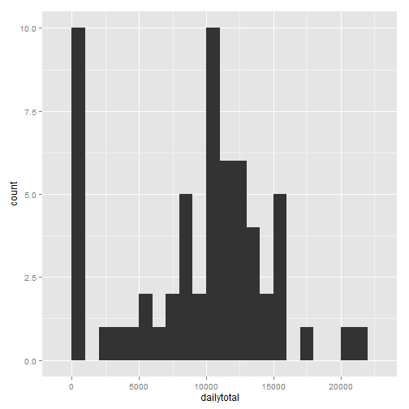
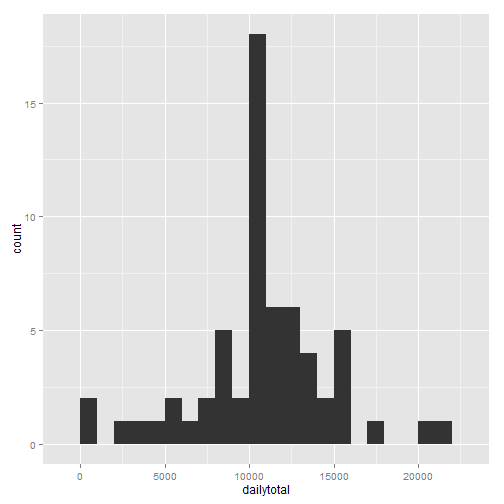
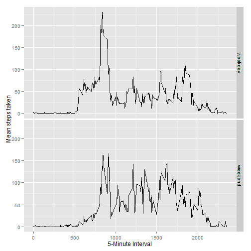

# Reproducible Research: Peer Assessment 1
==============================================

## Loading and preprocessing the data

Before we begin, we will use some libraries not included in the base package, this piece of code make sure they are installed correctly.


```r
if(require(xtable)) {
  message("Library xtable loaded correctly")
} else {
  message("Library xtable not found, attempting to install...")
  install.packages("xtable")
  if(require(plyr)) {
    message("Library xtable installed and loaded correctly")
  } else {
    stop("Could not install xtable")
  }
}
```

```
## Loading required package: xtable
## Library xtable loaded correctly
```

```r
if(require(plyr)) {
  message("Library plyr loaded correctly")
} else {
  message("Library plyr not found, attempting to install...")
  install.packages("plyr")
  if(require(plyr)) {
    message("Library plyr installed and loaded correctly")
  } else {
    stop("Could not install plyr")
  }
}
```

```
## Loading required package: plyr
## Library plyr loaded correctly
```

```r
if(require(ggplot2)) {
  message("Library plyr loaded correctly")
} else {
  message("Library ggplot2 not found, attempting to install...")
  install.packages("ggplot2")
  if(require(plyr)) {
    message("Library ggplot2 installed and loaded correctly")
  } else {
    stop("Could not install ggplot2")
  }
}
```

```
## Loading required package: ggplot2
## Library plyr loaded correctly
```


For the first part, we will temporarily download the file to the hard drive, and load the dataframe into R and delete the temporary files.


```r
## File URL Location

fileurl<- "http://d396qusza40orc.cloudfront.net/repdata%2Fdata%2Factivity.zip"

## Download file to a temporary location, read in dataframe, and delete tempfile

temp<-tempfile()
download.file(fileurl, temp)
filename<-unzip(temp, list=TRUE)[[1]]
data<-read.csv(unzip(temp,filename), na.strings = "NA")
unlink(temp)
unlink(filename)
str(data)
```

```
## 'data.frame':	17568 obs. of  3 variables:
##  $ steps   : int  NA NA NA NA NA NA NA NA NA NA ...
##  $ date    : Factor w/ 61 levels "2012-10-01","2012-10-02",..: 1 1 1 1 1 1 1 1 1 1 ...
##  $ interval: int  0 5 10 15 20 25 30 35 40 45 ...
```

We can see that the date column is misassigned as a factor, it would be better to classify this as an actual date


```r
data$date <- as.Date(data$date, format = "%Y-%m-%d")
str(data)
```

```
## 'data.frame':	17568 obs. of  3 variables:
##  $ steps   : int  NA NA NA NA NA NA NA NA NA NA ...
##  $ date    : Date, format: "2012-10-01" "2012-10-01" ...
##  $ interval: int  0 5 10 15 20 25 30 35 40 45 ...
```

The date seems to be fixed now. Let's look at a summary of the data


```r
xt <- xtable(summary(data))
print(xt, type = "html")
```

<!-- html table generated in R 3.1.0 by xtable 1.7-3 package -->
<!-- Sat Jun 14 21:09:53 2014 -->
<TABLE border=1>
<TR> <TH>  </TH> <TH>     steps </TH> <TH>      date </TH> <TH>    interval </TH>  </TR>
  <TR> <TD align="right"> 1 </TD> <TD> Min.   :  0.0   </TD> <TD> Min.   :2012-10-01   </TD> <TD> Min.   :   0   </TD> </TR>
  <TR> <TD align="right"> 2 </TD> <TD> 1st Qu.:  0.0   </TD> <TD> 1st Qu.:2012-10-16   </TD> <TD> 1st Qu.: 589   </TD> </TR>
  <TR> <TD align="right"> 3 </TD> <TD> Median :  0.0   </TD> <TD> Median :2012-10-31   </TD> <TD> Median :1178   </TD> </TR>
  <TR> <TD align="right"> 4 </TD> <TD> Mean   : 37.4   </TD> <TD> Mean   :2012-10-31   </TD> <TD> Mean   :1178   </TD> </TR>
  <TR> <TD align="right"> 5 </TD> <TD> 3rd Qu.: 12.0   </TD> <TD> 3rd Qu.:2012-11-15   </TD> <TD> 3rd Qu.:1766   </TD> </TR>
  <TR> <TD align="right"> 6 </TD> <TD> Max.   :806.0   </TD> <TD> Max.   :2012-11-30   </TD> <TD> Max.   :2355   </TD> </TR>
  <TR> <TD align="right"> 7 </TD> <TD> NA's   :2304   </TD> <TD>  </TD> <TD>  </TD> </TR>
   </TABLE>


## What is mean total number of steps taken per day?

We will use the ddply() function from the plyr package to summarise the data and make a dtotalDF dataframe. 


```r
dtotalDF <- ddply(
     data, 
     c("date"), 
     summarize, 
     dailytotal = sum(steps, na.rm = TRUE))

head(dtotalDF)
```

```
##         date dailytotal
## 1 2012-10-01          0
## 2 2012-10-02        126
## 3 2012-10-03      11352
## 4 2012-10-04      12116
## 5 2012-10-05      13294
## 6 2012-10-06      15420
```

It seems to have correctly summed up the dates, so let's make the histogram and calculate mean and median (to the nearest step).


```r
mean <- as.integer(mean(dtotalDF$dailytotal))
median <- as.integer(median(dtotalDF$dailytotal))
qplot(data = dtotalDF, x = dailytotal, geom = "histogram", binwidth = 1000)
```

 

The mean number of steps taken each day is __9354__  
The median number of steps taken each day is __10395__   

## What is the average daily activity pattern?

For this part we will use a similar method to summarize the data using the ddply
function.      

This time, we will summarize by interval as the identifier.
     


```r
intervalsDF <- ddply(
     data, 
     c("interval"), 
     summarize, 
     mean = mean(steps, na.rm = TRUE))

ggplot(intervalsDF, aes(x = interval, y = mean)) +
     geom_line()
```

 

```r
maxmean <- format(
     intervalsDF[intervalsDF$mean==max(intervalsDF$mean, na.rm=TRUE),"mean"],
     digits = 3)

maxinterval <- as.numeric(format(
     intervalsDF[intervalsDF$mean==max(intervalsDF$mean, na.rm=TRUE),"interval"],
     digits = 3))

hours <- as.numeric(trunc(maxinterval/60))
minutes <- as.numeric(format(maxinterval - hours*60, digits = 0))


maxtime <- strptime(paste(hours, minutes, sep = ":"), "%H:%M")
maxtime <- format(maxtime, format = "%I:%M %P")
```

Averaged over all days the 5-minute interval with the most number of steps occurred at __01:55 pm__, or interval __835__. <br />
<br />
The number of steps recorded during this time was __206__

## Imputing missing values

First, count the number of rows with NAs in them.


```r
head(data)
```

```
##   steps       date interval
## 1    NA 2012-10-01        0
## 2    NA 2012-10-01        5
## 3    NA 2012-10-01       10
## 4    NA 2012-10-01       15
## 5    NA 2012-10-01       20
## 6    NA 2012-10-01       25
```

```r
sum(rowSums(is.na(data)))
```

```
## [1] 2304
```

There are a lot!    

For simplicity sake, we will replace NA values with the mean number of steps for that specific interval accross all days (already computed in the intervalsDF above)  

"NAintervals" is a vector containing what the interval value is for that specific NA value in the steps column.    

"index" is a vector containing the indeces where there is a NA value.

The replacement is carried out by a for loop.


```r
imputDF <- data

NAintervals <- imputDF[is.na(imputDF),"interval"]

index <- which(is.na(imputDF))

for (i in 1:length(NAintervals)) {
     imputDF[index[i],"steps"] <- intervalsDF[intervalsDF$interval==NAintervals[i],"mean"]
}

head(imputDF)
```

```
##     steps       date interval
## 1 1.71698 2012-10-01        0
## 2 0.33962 2012-10-01        5
## 3 0.13208 2012-10-01       10
## 4 0.15094 2012-10-01       15
## 5 0.07547 2012-10-01       20
## 6 2.09434 2012-10-01       25
```

We will now just copy and paste code from above to redo the histogram above, but using the imputed dataset


```r
dtotalDF <- ddply(
     imputDF, 
     c("date"), 
     summarize, 
     dailytotal = sum(steps, na.rm = TRUE))

mean <- as.integer(mean(dtotalDF$dailytotal))
median <- as.integer(median(dtotalDF$dailytotal))
qplot(data = dtotalDF, x = dailytotal, geom = "histogram", binwidth = 1000)
```

 

Using the imputed dataframe:  
The mean number of steps taken each day is __10766__  
The median number of steps taken each day is __10766__   

Since the NAs were biasing the daily totals toward 0 when they were present, when they were replaced with the daily mean for that interval, the daily totals were expected to increase. The net impact of imputing the missing data is that the estimates of total daily number of steps is expected to increase.This is reflected in the increase in the above mean and median.

## Are there differences in activity patterns between weekdays and weekends

For this solution, we need to use the weekdays function. We will assign everything that weekdays() returns as "Saturday" or "Sunday" a weekend, everything else will be a weekday.

Then, we will use ddply() splitting on weekday and interval, to obtain means at each time interval for weekend or weekday.  

Lastly, ggplot will be used, using facet_grid to trellis based on weekend or weekday.


```r
imputDF$weektime[weekdays(imputDF$date) %in% c("Saturday", "Sunday")] <- "weekend"
imputDF$weektime[!(weekdays(imputDF$date) %in% c("Saturday", "Sunday"))] <- "weekday"

weektimeDF <- ddply(
     imputDF, 
     c("weektime", "interval"), 
     summarize, 
     means = mean(steps, na.rm = TRUE))

head(weektimeDF)
```

```
##   weektime interval   means
## 1  weekday        0 2.25115
## 2  weekday        5 0.44528
## 3  weekday       10 0.17317
## 4  weekday       15 0.19790
## 5  weekday       20 0.09895
## 6  weekday       25 1.59036
```

```r
tail(weektimeDF)
```

```
##     weektime interval   means
## 571  weekend     2330  1.3880
## 572  weekend     2335 11.5873
## 573  weekend     2340  6.2877
## 574  weekend     2345  1.7052
## 575  weekend     2350  0.0283
## 576  weekend     2355  0.1344
```

```r
ggplot(weektimeDF, aes(interval, means)) +
     geom_line() +
     facet_grid(weektime~.) +
     geom_line() +
     xlab("5-Minute Interval") +
     ylab("Mean steps taken")
```

 
